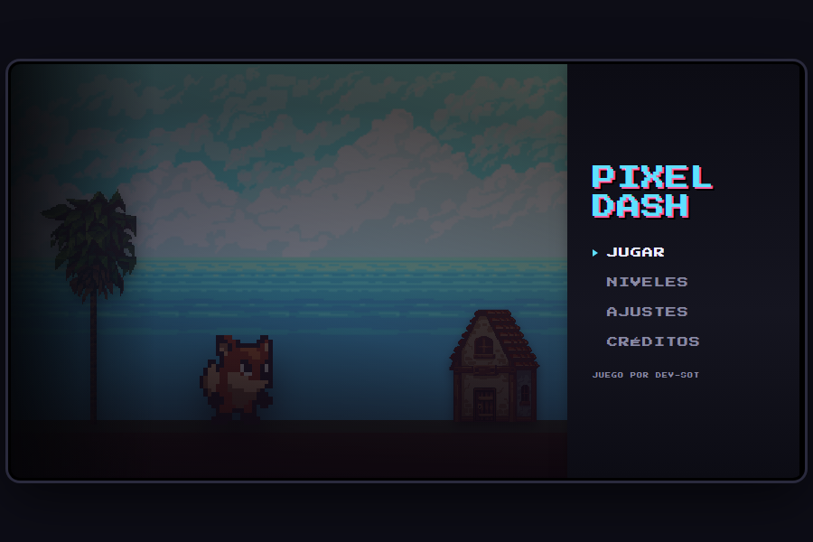
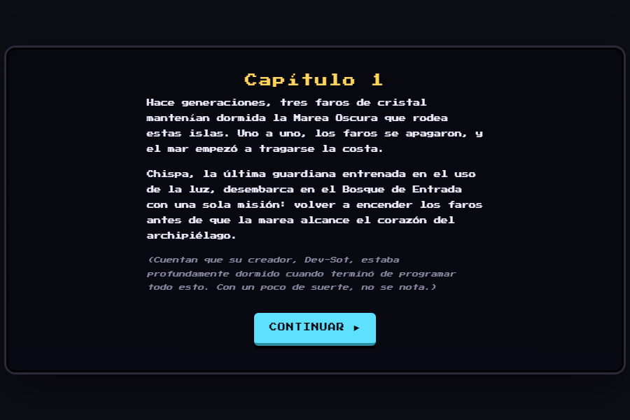
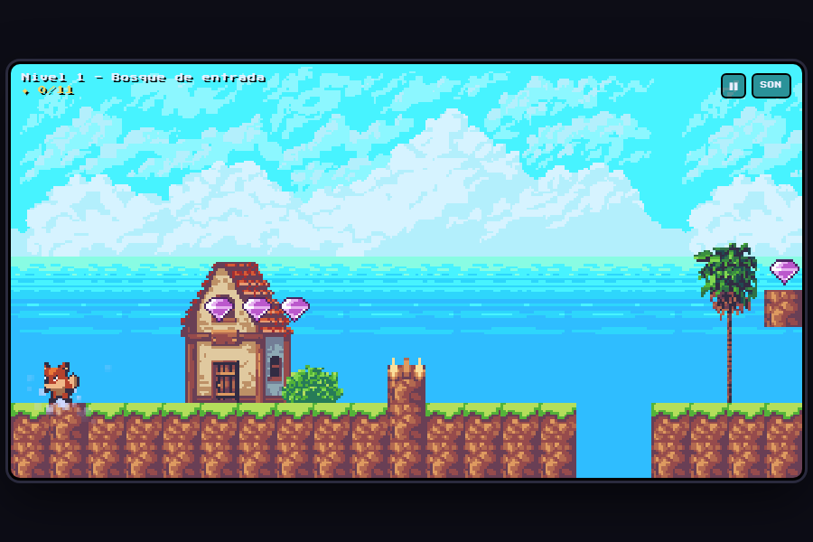
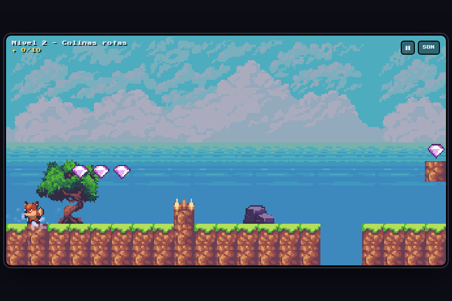
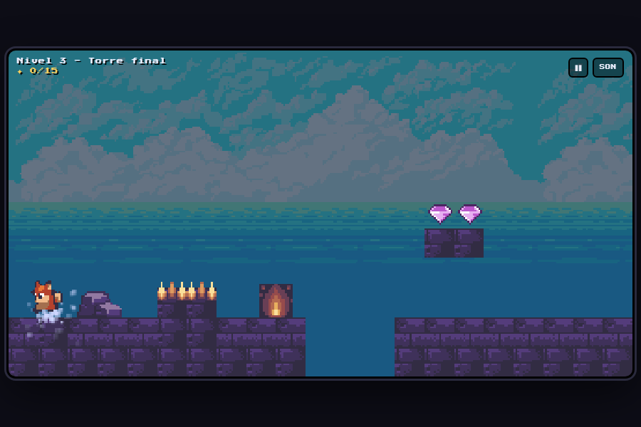

# Pixel Dash

Plataformero de niveles cortos en pixel art, hecho con JavaScript plano y `<canvas>` — sin
frameworks, sin build. Chispa, la última guardiana de los faros, cruza tres islas para
volver a encender la luz antes de que la Marea Oscura se lo trague todo.



## Capturas

| Capítulo (historia) | Nivel 1 — día | Nivel 2 — atardecer | Nivel 3 — noche |
|---|---|---|---|
|  |  |  |  |

## El juego

- **3 niveles** con progresión día → atardecer → noche, cada uno con su propia música.
- **Pantallas de historia** (capítulo) antes de cada nivel, tipo novela visual.
- **Movimiento fluido**: correr, saltar (con coyote time y buffer de salto) y una
  **rodada/dash** que esquiva pinchos.
- **Enemigos** que patrullan — se derrotan saltándoles encima, tocarlos de costado
  cuesta la partida.
- Monedas, pinchos, plataformas y una meta por nivel; progreso guardado en el navegador.
- Menú navegable con teclado, selección de nivel, ajustes de música/efectos por
  separado, y créditos.

## Controles

| Acción | Teclado | Táctil |
|---|---|---|
| Mover | `← →` / `A D` | botones en pantalla |
| Saltar | `ESPACIO` / `↑` / `W` | botón &#8593; |
| Rodar (esquiva pinchos) | `SHIFT` / `X` | botón ROD |
| Pausa | `ESC` / `P` | botón de pausa en el HUD |
| Navegar el menú | `↑ ↓` + `ENTER` | tap |

## Ejecutarlo localmente

```bash
npx serve .
# o
python3 -m http.server 8080
```

También podés abrir `index.html` directo con doble clic — no requiere servidor,
porque todo el código usa `<script>` clásicos (sin ES modules ni `fetch`).

## Estructura del código

```
index.html          shell: canvas, overlays de menú/historia/pausa/créditos, HUD
css/style.css        estilos
js/
  assets.js          carga de imágenes
  audio.js            música/SFX (archivos reales, con sintetizador de respaldo)
  input.js            teclado + botones táctiles
  levels.js           datos de los 3 niveles (grilla, enemigos, props, historia)
  tilemap.js           colisión contra la grilla, cámara, dibujo del nivel y props
  player.js            física del jugador, animación (idle/run/salto/rodada)
  enemies.js           patrulla de enemigos y colisión (stomp / golpe)
  scenes.js             máquina de estados: menú → historia → nivel → pausa →
                         victoria/derrota → créditos
  main.js               bootstrap + loop
assets/
  sprites/fox/, sprites/enemies/, sprites/tiles/, sprites/props/, backgrounds/, audio/
```

## Créditos

Todos los assets (personaje, enemigos, entorno, música y efectos) son gratuitos con
licencia libre — ver [CREDITS.md](CREDITS.md) o el menú **Créditos** dentro del juego.

## Desplegarlo en Vercel

**Opción A — Dashboard (más fácil):**
1. Entra a https://vercel.com → New Project.
2. Importa el repo `pixel-dash` desde GitHub.
3. Framework Preset: **Other** (sitio estático, no necesita build).
4. Deploy.

**Opción B — CLI:**
```bash
npm i -g vercel
vercel login
vercel --prod
```

Cada `git push` a `main` vuelve a desplegar automáticamente.

## Editar el juego con Claude

Ideas rápidas para pedir mejoras:
- "Agrega un power-up que aguante un golpe"
- "Suma un cuarto nivel"
- "Agrega vibración (navigator.vibrate) al chocar en móvil"
